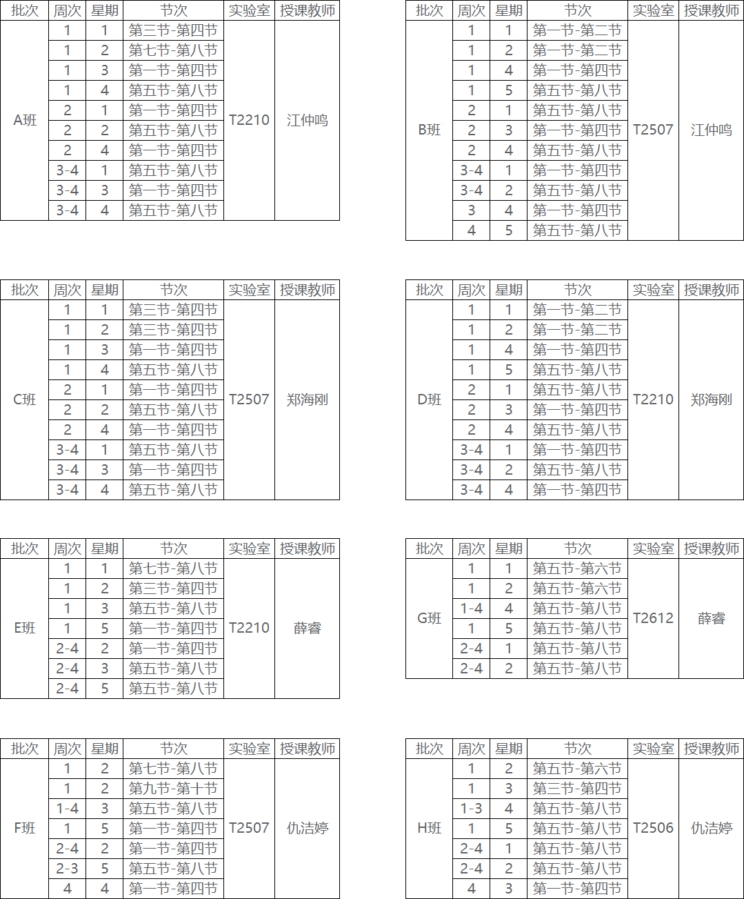

!!! warning "声明 :loudspeaker:"
    &emsp;&emsp;本课程资料仅限哈尔滨工业大学（深圳）《计算机设计与实践》2026夏季课程使用，严禁扩散或用作其他用途。

# 课程概况

&emsp;&emsp;本实验文档为哈尔滨工业大学（深圳）《计算机设计与实践》课程实验指导材料。页面顶端为实验的指导书，页面左侧为指导书的各个小节目录，右侧为小节内的索引，页面右上角可详细搜索，页面下方可切换上下小节。请务必按顺序阅读指导书，有问题积极在群内提出。

!!! info "提示 :mega:"
    &emsp;&emsp;在开始之前，请回顾《数字逻辑设计》、《计算机组成原理》课程的相关理论和实践的知识、技能。

&emsp;&emsp;

## 相关链接

<!-- - ==线上答疑平台==：<a href="https://piazza.com/hitsz/summer2023/comp2012" target="_blank">Piazza/COMP2012</a>（访问码：`comp2012`） -->

- ==<a href="http://10.249.14.10:2012/" target="_blank">**点击下载课程材料**</a>==

- 在线答疑文档：

<embed src = "https://docs.qq.com/doc/DZHNIeWxpQVp2UmZ1?is_no_hook_redirect=1" width="100%" height="600">

## 课程任务说明

&emsp;&emsp;本课程的项目内容采用2人小组的形式协作完成，最终目标是实现能够在FPGA开发板上运行CoreMark或LLAMA2推理程序的流水线SoC。

&emsp;&emsp;同学们可自行组队，找不到队友的由授课教师随机分组，^^**非特殊情况不得跨课表组队**^^。

&emsp;&emsp;组内成员的任务分配参考下表所示。

小组合作任务分配表

 <table>
  <tr>
   <th align="center">项目内容</th>
   <th align="center">小组任务1</th>
   <th align="center">小组任务2</th>
  </tr>
  <tr>
   <th rowspan=5 style="text-align: center; vertical-align: middle;">实验1： 单周期CPU</th>
   <td align="left"><a href="../lab1/0-overview" target=_blank>A组指令</a>的数据通路表、控制信号表</td>
   <td align="left"><a href="../lab1/0-overview" target=_blank>B组指令</a>的数据通路表、控制信号表</td>
  </tr>
  <tr>
   <td align="left" colspan=2>【合作】讨论交流，共同完成完整单周期CPU的数据通路图绘制</td>
  </tr>
  <tr>
   <td align="left">A组指令的单周期CPU实现</td>
   <td align="left">B组指令的单周期CPU实现</td>
  </tr>
  <tr>
   <td align="left">A组指令的单周期CPU通过Basic Trace测试</td>
   <td align="left">B组指令的单周期CPU通过Basic Trace测试</td>
  </tr>
  <tr>
   <td align="left" colspan=2>【合作】讨论交流，共同把代码整合成完整的单周期CPU，并通过Basic Trace测试</td>
  </tr>
  <tr>
   <th rowspan=5 style="text-align: center; vertical-align: middle;">实验2： 流水线CPU及SoC</th>
   <td align="left">把完整的单周期CPU改造成理想流水线</td>
   <td align="left">把ICache、DCache集成到完整的单周期CPU</td>
  </tr>
  <tr>
   <td align="left">流水线冒险检测</td>
   <td align="left">为单周期CPU实现AXI总线控制器</td>
  </tr>
  <tr>
   <td align="left">暂停法解决流水线冒险</td>
   <td align="left">完成C语言的接口编程、实现I/O接口电路</td>
  </tr>
  <tr>
   <td align="left">前递法解决流水线冒险</td>
   <td align="left">使用C程序对单周期SoC进行下板测试</td>
  </tr>
  <tr>
   <td align="left" colspan=2>【合作】讨论交流，共同完成流水线SoC的代码整合、AXI Trace测试、下板测试、报告等</td>
  </tr>
 </table>

&emsp;&emsp;组内成员如果在实验1负责小组任务1，则实验2时也可选择小组任务2，反之亦然。

&emsp;&emsp;需在课上现场检查的内容：（1）完整单周期CPU的数据通路图；（2）SoC运行CoreMark或LLAMA2推理程序的下板测试。^^**现场验收时，小组成员必须同时到场**^^。

&emsp;&emsp;关于Trace测试的说明：后续提交代码后，由程序自动评测给出分数，故不需在课上检查。

## 各班级课表

- 少部分同学若课表存在冲突，请自行根据以下课表挑选合适的时间上课。

- ^^换时间上课请提前告知相关任课老师，否则可能被误当成缺课^^。

- ^^各班人数均接近实验室最大容量^^，**非必要请勿换班上课！自习的请自觉在其他班上课前离开！** 否则座位可能不够！

!!! abstract "致谢 :rose:"
    - 特别鸣谢17级胡博涵、18级黎庚祉、19级罗尹同学在Trace测试框架上做出的贡献。

    - 特别鸣谢19级罗翊洲同学在LA32R汇编工具上做出的贡献。
