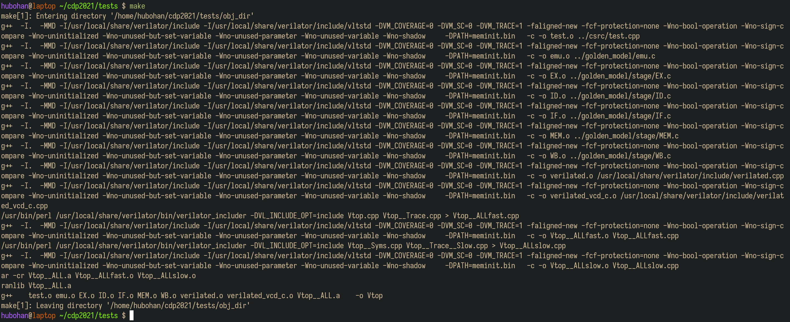
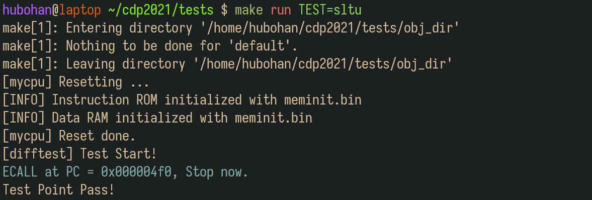
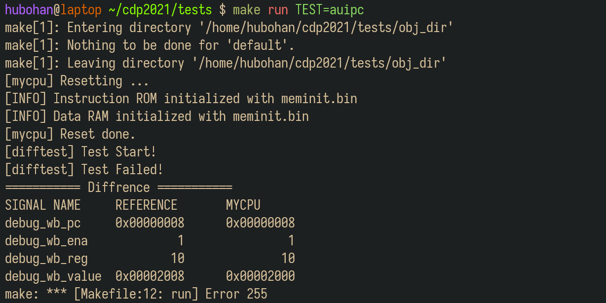

## 1. 关于实验环境

&emsp;&emsp;Trace测试使用Linux系统部署测试环境，我们提供了三种实验环境供同学们选择：

**（1）实验室虚拟机**

&emsp;&emsp;实验室的台式机均已提前安装好基于WSL2虚拟机的实验环境，推荐同学们直接使用。

&emsp;&emsp;WSL2虚拟机最方便的地方之一就是可以快速实现系统之间的文件拷贝。

**（2）远程实验平台**

&emsp;&emsp;远程实验平台的资源和性能有限，不要在上课期间使用，否则服务器负载能力有限，会导致使用体验很差。

&emsp;&emsp;远程实验平台已经将Trace测试的运行环境部署在实验中心的服务器上，我们把所有依赖的配置都已经事先搭建完毕。无论你的电脑性能如何，无论你是在宿舍、实验室还是自习室，只要你还能连上校园网，你就能完成你的实验。具体使用方式详见<a href="../remote_env/" target="_blank">附录A：远程实验环境使用指南</a>。

!!! info "温馨提示"
    &emsp;&emsp;虽然我们已经做了一些方案保证远程环境的可靠性，但在某些特殊情况下，也不能确保不出故障，为安全起见，建议同学们将代码及时上传到git仓库或者下载到本地保存。

**（3）自行部署实验环境**

&emsp;&emsp;如果要自行安装环境，推荐安装WSL2虚拟机。安装说明见<a href="../vm/" target="_blank">附录B：虚拟机使用指南</a>。

&emsp;&emsp;感兴趣的同学也可以尝试在自己的电脑上从零开始安装实验环境，体验一下自己动手的乐趣：）具体搭建方法详见<a href="../env_diy/" target="_blank">附录C：实验环境部署指南</a>。


## 2. 了解测试框架

&emsp;&emsp;下面以WSL2虚拟机为例，介绍Trace测试框架使用方法。

&emsp;&emsp;首先在桌面上打开wsl2distromanager，并启动comp2008虚拟机。

&emsp;&emsp;在虚拟机终端输入并执行下列命令，以拉取测试框架代码：

``` bash linenums="1"
cd ~ && git clone https://gitee.com/hitsz-cslab/cdp-tests.git
```

!!! info "关于miniLA :loudspeaker:"
    &emsp;&emsp;实现miniLA指令集的同学，拉取测试框架时，请执行以下命令：

    ``` bash linenums="1"
    cd ~ && git clone -b miniLA https://gitee.com/hitsz-cslab/cdp-tests.git
    ```

&emsp;&emsp;cdp-tests目录的文件结构如下图所示。

```
.
├── bin             # 指令测试用例，用于初始化内存
│   ├── add.bin
│   ├── .......
│   ├── xor.bin
│   └── xori.bin
├── asm             # 指令测试用例的反汇编文件，用于阅读汇编代码来辅助调试
│   ├── add.dump
│   ├── .......
│   ├── xor.dump
│   └── xori.dump
├── csrc            # 测试驱动框架，包括比对逻辑
│   ├── dut.h
│   └── test.cpp
├── golden_model    # C语言编写的CPU行为模型
│   ├── emu.c
│   ├── include/...
│   └── stage/...
├── waveform        #【运行测试后生成】的波形文件，用于查看波形来辅助调试
│   ├── add.vcd
│   ├── ........
│   └── xori.vcd
├── Makefile
├── mySoC           # 你实现的SoC的Verilog代码，放在此目录下，仅拷贝HDL代码，不拷贝IP核
│   ├── miniRV(或LA)_SoC.v
|   ├── defines.vh
│   └── ......
├── vsrc            # 仿真需要用到的其他文件
|   ├── ram.v       # Basic测试的主存模块，不含总线
│   └── bram_axi.v  # AXI测试的主存模块
├── run_all_tests.py        # 自动化测试脚本
├── Makefile
├── sim_simple.surf.ron     # 单周期CPU的Surfer波形配置文件
└── sim_pipeline.surf.ron   # 流水线CPU的Surfer波形配置文件
```

&emsp;&emsp;测试的原理是差分测试，即比对标准模型和待测模型之间的区别。在实验中，标准模型就是`golden_model`下使用C语言实现的CPU模型，而待测模块就是你所实现的CPU。驱动测试的代码逻辑位于`csrc`文件夹中，分别让标准模型和待测模型执行同一条指令，比对他们执行的结果，来确定你的CPU是否实现正确。**你只需要关注`mySoC`目录，暂时不需要关注其他目录，你需要将自己实现的CPU的Verilog代码粘贴到这个目录下。**


## 3. 添加待测试代码

&emsp;&emsp;`mySoC`目录存放待测试CPU、总线控制器以及SoC顶层模块及其对外的连线等代码文件。运行测试时，需要将整个SoC工程的代码复制到该目录下。拷贝代码时，需要注意：
 
- 把Vivado工程目录的 `src` / `rtl` 下的所有源文件拷贝到 `cdp-tests` / `mySoC` 目录。**不要拷贝`ip`文件夹**，也 **不要拷贝IP核相关文件**。

- 如果使用WSL2虚拟机，在Windows下把源文件拷贝到虚拟机之后，有时会出现许多带有`Zone.Identifier`后缀的文件。这些文件需要全部删除，否则测试无法运行。删除方法是在文件资源管理器的搜索框搜索`Zone.Identifier`，然后快捷键 ++ctrl+a++ 全选后删除。

- **保证`mySoC`目录下的架构是`miniRV_SoC`（或`miniLA_SoC`）包含`cpu_top`，然后`cpu_top`包含`cpu_core`，且这些模块的模块名、实例名，以及`cpu_core`的接口信号均不要改动**。课程提供的模板工程默认满足要求，不要改动。

- **不要修改所有源文件中任何出现`RUN_TRACE`宏定义的代码。**

- **不要修改所有源文件中任何在行内出现`/* verilator public */`的代码，并且不要删除或修改此注释。**

- 在Trace测试框架中，SoC顶层模块的复位信号`fpga_rst`是高电平复位。

- 系统复位后首条指令的地址是`0x00000000`。

&emsp;&emsp;<u>**Trace测试框架会根据SoC是否支持AXI总线，自动进行相应架构的测试**</u>，如下图所示：

<center></center>

&emsp;&emsp;Basic Trace只会测试CPU内核，而AXI Trace会将CPU连同ICache、DCache和总线一起测试。

!!! danger "**Trace测试框架只会测试主存访问，不会测试外设访问**"
    &emsp;&emsp;如果SoC通过了AXI Trace测试，但下板测试失败，则首先应排查Uncached访问和外设访问的实现是否存在问题。

&emsp;&emsp;Trace测试框架使用`cpu_core.v`末尾的两组Trace信号来获取待测试CPU的部分结构状态。其中，第一组带有`debug_wb_`前缀的信号用于获取写回寄存器的信息，第二组带有`debug_mem_`前缀的则用于获取写访存的信息。单周期CPU的demo工程已提前连接好两组Trace信号：

```verilog title="cpu_core.v" linenums="252"
wire [31:0] debug_wb_pc    /* verilator public */ ;     // WB阶段的PC
wire        debug_wb_rf_we /* verilator public */ ;     // WB阶段的寄存器写使能
wire [ 4:0] debug_wb_rf_wR /* verilator public */ ;     // WB阶段的目标寄存器   (若wb_rf_we为0，此项可为任意值)
wire [31:0] debug_wb_rf_wD /* verilator public */ ;     // WB阶段写入寄存器的值 (若wb_rf_we为0，此项可为任意值)

wire [31:0] debug_mem_pc    /* verilator public */ ;    // MEM阶段的PC
wire [ 3:0] debug_mem_we    /* verilator public */ ;    // MEM阶段写访存时的写使能
wire [31:0] debug_mem_waddr /* verilator public */ ;    // MEM阶段写访存时的写地址 (若mem_we为0，此项可为任意值)
wire [31:0] debug_mem_wdata /* verilator public */ ;    // MEM阶段写访存时的写数据 (若mem_we为0，此项可为任意值)

assign debug_wb_pc    = pc;
assign debug_wb_rf_we = rf_we1;
assign debug_wb_rf_wR = rf_wR;
assign debug_wb_rf_wD = rf_wD;

assign debug_mem_pc    = pc;
assign debug_mem_we    = daccess_wen;
assign debug_mem_waddr = daccess_addr;
assign debug_mem_wdata = daccess_wdata;
```

&emsp;&emsp;在开发流水线CPU及SoC时，请参照上述代码中的注释，自行连接两组Trace信号。注意，**对于同一条指令，每一组信号只能有效一个时钟周期，特别是`debug_wb_rf_we`和`debug_mem_we`**。

!!! question "对于流水线，一定是连接WB阶段、MEM阶段的信号吗？"
    &emsp;&emsp;不一定。第一组Trace信号的作用是获取写回寄存器的信息，而第二组则是为了获取写访存的信息。因此，你的流水线CPU在哪个阶段写回寄存器，就把哪个阶段的信号连接到第一组Trace信号。同理，流水线CPU在哪个阶段发出写访存请求，就把哪个阶段的信号连接到第二组Trace信号。

!!! question "运行AXI Trace测试时，第二组Trace信号没报错，代表Store指令的写访存操作一定没问题吗？"
    &emsp;&emsp;不一定。第二组Trace信号只能帮助Trace测试框架判断CPU发出的写请求是否正确，但写请求后续传输到DCache、总线、存储器的路径上都有可能出错，导致写访存失败，从而数据没有被正确写入主存。出现这种这种情况时，Trace测试会在后续相同访存地址的Load指令处报错。

&emsp;&emsp;若运行Basic Trace测试，需要保证代码中实例化了`IROM`、`DRAM`（模板工程默认已实例化）：

``` Verilog title="Inst_ROM.v, Data_RAM.v"
IROM U_irom (       // 模块名必须是IROM
    .clka   (...),
    .addra  (...),
    .douta  (...)
);
    
DRAM U_dram (       // 模块名必须是DRAM
    .clka   (...),
    .addra  (...),
    .douta  (...),
    .wea    (...),
    .dina   (...)
);
```

&emsp;&emsp;若运行AXI Trace测试，需要保证代码中实例化了`bram_axi`：

``` Verilog title="miniRV_SoC.v, miniLA_SoC"
bram_axi U_bram (               // 模块名必须是bram_axi
    .s_aclk         (...),
    .s_aresetn      (...),
    .s_axi_awid     (...),
    .s_axi_awaddr   (...),
    .s_axi_awlen    (...),
    .s_axi_awsize   (...),
    .s_axi_awburst  (...),
    .s_axi_awready  (...),
    .s_axi_awvalid  (...),
    .s_axi_wdata    (...),
    .s_axi_wstrb    (...),
    .s_axi_wvalid   (...),
    .s_axi_wlast    (...),
    .s_axi_wready   (...),
    .s_axi_bready   (...),
    .s_axi_bresp    (...),
    .s_axi_bvalid   (...),
    .s_axi_arid     (...),
    .s_axi_araddr   (...),
    .s_axi_arlen    (...),
    .s_axi_arsize   (...),
    .s_axi_arburst  (...),
    .s_axi_arready  (...),
    .s_axi_arvalid  (...),
    .s_axi_rdata    (...),
    .s_axi_rvalid   (...),
    .s_axi_rlast    (...),
    .s_axi_rready   (...),
    .s_axi_rresp    (...)
);
```


## 4. 运行测试

&emsp;&emsp;把待测试代码拷贝到 `cdp-tests` / `mySoC` 目录后，在虚拟机终端执行下列命令进入`cdp-tests`目录：

``` bash linenums="1"
cd cdp-tests
```

&emsp;&emsp;然后继续在终端执行`make`命令，从而编译代码，生成可执行的仿真模型。



### 4.1 运行单个测试

&emsp;&emsp;所有的测试用例都位于`bin`文件夹下，输入下列命令即可获取测试用例名称：

``` bash linenums="1"
ls bin
```

&emsp;&emsp;每个测试用例的名称都和某条指令的名称相同，但测试用例内部使用了多条不同的指令。

&emsp;&emsp;第一次运行测试时，推荐选择单个测试运行。例如，我们想运行`sltu`指令的测试用例，则在终端执行命令：

``` bash linenums="1"
make run TEST=sltu
```



&emsp;&emsp;打印出Test Point Pass之后，就代表这条指令测试通过了。

&emsp;&emsp;如果发生了错误，就会打印如下所示的信息：



&emsp;&emsp;左栏为参照的正确实现，右栏为你实现的CPU给出的信号，通过比对这两组信号，你可以很快地确定错误发生在哪一条指令执行过程中，然后通过反汇编和波形的形式进行调试。

### 4.2 查看波形

&emsp;&emsp;运行某个测试之后，测试框架会在`waveform`文件夹下生成对应的.vcd波形文件。.vcd格式的波形文件可以使用GTKWave、Surfer等常用的波形查看器查看。

&emsp;&emsp;打开桌面上的Surfer工具，然后直接把`waveform`文件夹下的.vcd波形文件拖拽到Surfer，如下图所示。

<center></center>

&emsp;&emsp;然后把`cdp-tests`目录下的.surf.ron格式的波形配置文件拖拽到Surfer，如下图所示。

<center></center>

&emsp;&emsp;修改HDL代码并重新编译、重新运行测试后，只需点击左上角工具栏的刷新按钮，即可查看最新的波形，如下图所示。

<center></center>

&emsp;&emsp;更多Surfer工具的使用方法，请查看<a href="../surfer" target=_blank>附录D. Surfer使用指南</a>。

### 4.3 查看反汇编

&emsp;&emsp;反汇编文件在`asm`文件夹下。在上述的`auipc`的测试例子中，可见在PC等于0x8处出现了错误，写回值有误。通过查看和分析`auipc.dump`中的反汇编指令，可以帮助我们找到出错的指令。

<center></center>

&emsp;&emsp;请根据出错点，结合波形和反汇编代码，完成调试。

### 4.4 批量运行测试

&emsp;&emsp;`cdp-tests`目录下提供`run_all_tests.py`的脚本来进行批量测试。

&emsp;&emsp;首先确保已执行过`make`命令，且编译没有报错，然后执行下列命令：

``` bash linenums="1"
python3 run_all_tests.py
```

&emsp;&emsp;脚本运行结束后，会在最末尾输出测试总结报告。该报告会列出当前代码已通过和未通过的测试数量及测试名称。对于未通过的测试，请结合`waveform`目录下的波形和`asm`目录下的反汇编代码进行调试。

&emsp;&emsp;通过Basic Trace测试的示意图：

<center></center>

&emsp;&emsp;通过AXI Trace测试的示意图：

<center></center>


<!-- **（2）使用start测试程序自动测试**

!!! info "关于miniLA :loudspeaker:"
    &emsp;&emsp;miniLA的Trace测试包无此功能，故可略过。

&emsp;&emsp;输入以下命令:

``` bash linenums="1"
make run TEST=start
```

&emsp;&emsp;如果你的mycpu能够支持37条指令（24条必做和13条选做），则会显示“Test Point Pass!”。

<center></center>

&emsp;&emsp;如果测试显示“[difftest] Test Failed!”，说明没有通过37条指令测试。Digiti的数值则表示你的mycpu通过的功能点数，其高8位为0x25，表示共有37个测试点，低8位表示通过的测试点数。

<center></center>

&emsp;&emsp;例如，上图所示的测试结果表面，该CPU通过了0x18，即24条指令的测试。 -->
